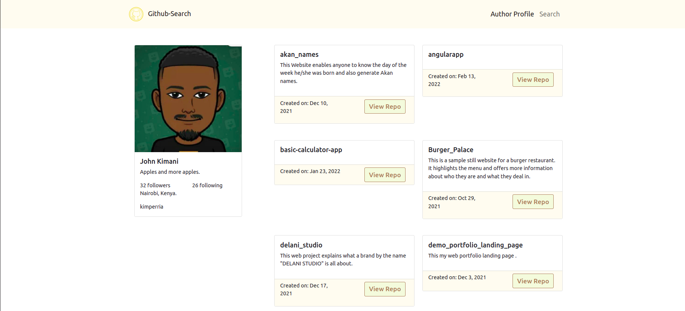

# github-search

github-search is a web application that allows users to preview my github profile and as well search for other github users.

## Screenshot



## Known Bug
### Importance notice
Home page (component) is still under maintanance, Kindly navigate to other pages using the above navbar provided.
## Installation

Install github-search application with npm

```bash
  npm install github-search
  cd github-search
```
### Clone this repository
```bash
 git clone git@github.com:John-Kimani/Quote-App.git
 cd github-search
 code .
 ng serve --open
```
## Features and BDD

- This application previews my github account profile.
- Users can search and find other github profiles.


## Deployment

To deploy this project run

```bash
  npm run deploy
```

### Live Link
[github-search](https://john-kimani.github.io/github-search/)

## Technology Used

**Framework:** Angular version 13.2.0

### Developed with
**Structure:** Bootstrap, HTML
**Behaviour:** Typescript
**Style:** CSS
## Color Reference

| Color             | Hex                                                                |
| ----------------- | ------------------------------------------------------------------ |
| Floral White |  #fffbf0 |


## Author

Design and developed by: [@John-Kimani](https://github.com/John-Kimani)

